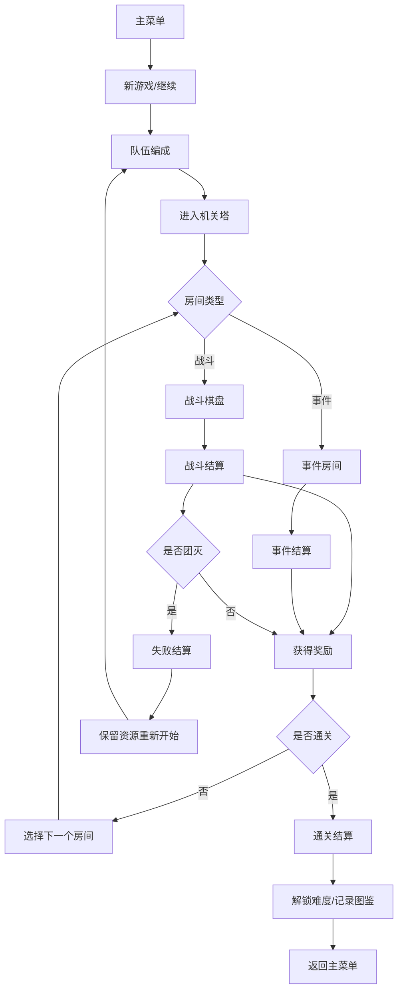

## 1. 产品概述

《机关塔》是一款纯前端回合制策略游戏，玩家带领三名角色探索神秘多变的古代机关塔。游戏融合了策略战斗、roguelike随机元素和装备收集系统，玩家需要在不断变化的塔中做出明智的决策，合理分配资源，最终征服高塔。

- **核心玩法**：回合制战棋战斗 + 事件房间探索 + 装备词条收集
- **目标用户**：策略游戏爱好者、roguelike玩家、喜欢深度系统的核心玩家
- **市场价值**：提供无需安装的高品质网页游戏体验，支持多周目游玩和难度挑战

## 2. 核心功能

### 2.1 用户角色
| 角色 | 注册方式 | 核心权限 |
|------|----------|----------|
| 玩家 | 本地存档 | 游戏内所有功能，本地存档保存进度 |

### 2.2 功能模块
1. **主菜单**：开始游戏、继续游戏、图鉴、设置、退出
2. **队伍编成**：角色职业选择、站位调整、技能冷却查看
3. **战斗棋盘**：格子移动、攻击、守备、道具四类指令
4. **事件房间**：解谜、交易、休整、风险四种事件类型
5. **战利品背包**：装备管理、词条查看、套装效果
6. **结算页**：战斗结算、失败保留资源、难度解锁、图鉴记录

### 2.3 页面详情
| 页面名称 | 模块名称 | 功能描述 |
|----------|----------|----------|
| 主菜单 | 菜单导航 | 新游戏、继续、图鉴、设置选项，背景动画展示机关塔 |
| 主菜单 | 存档管理 | 本地存档读取/写入，显示上次进度 |
| 队伍编成 | 角色选择 | 6种职业可选：战士、法师、刺客、牧师、游侠、守卫 |
| 队伍编成 | 站位调整 | 3x2网格拖拽调整前后排站位 |
| 队伍编成 | 技能面板 | 显示每个角色的技能列表和冷却回合数 |
| 战斗棋盘 | 战场网格 | 6x6战斗区域，显示角色和敌人位置 |
| 战斗棋盘 | 指令面板 | 移动、攻击、守备、道具四类行动选项 |
| 战斗棋盘 | 状态显示 | 生命值、能量值、buff/debuff状态图标 |
| 战斗棋盘 | 回合流程 | 玩家回合→敌人回合交替，行动顺序基于速度 |
| 事件房间 | 解谜事件 | 选择正确答案获得奖励，错误受到惩罚 |
| 事件房间 | 交易事件 | 消耗金币购买装备、道具、恢复品 |
| 事件房间 | 休整事件 | 恢复部分生命值，解除负面状态 |
| 事件房间 | 风险事件 | 高风险高回报选项，可能获得稀有装备或损失生命 |
| 战利品背包 | 装备列表 | 显示所有装备，按部位分类 |
| 战利品背包 | 词条系统 | 每个装备有随机词条，影响属性 |
| 战利品背包 | 套装效果 | 穿戴多件同套装激活额外效果 |
| 战利品背包 | 装备对比 | 对比当前穿戴和背包装备属性 |
| 结算页 | 战斗结算 | 显示伤害统计、获得经验、掉落物品 |
| 结算页 | 失败结算 | 保留部分金币和装备，可重新开始 |
| 结算页 | 通关奖励 | 解锁更高难度，记录到图鉴 |
| 图鉴 | 怪物图鉴 | 已击败敌人的属性和掉落记录 |
| 图鉴 | 装备图鉴 | 已获得装备的词条和套装记录 |

## 3. 核心流程

**玩家流程描述**：
1. 玩家从主菜单开始新游戏，进入队伍编成界面
2. 从6种职业中选择3名角色，调整前后排站位
3. 进入机关塔，每层随机生成3个房间选项
4. 遇到战斗房间：在6x6棋盘上进行回合制战斗
5. 遇到事件房间：选择解谜/交易/休整/风险四种选项
6. 完成房间后获得金币、装备、经验奖励
7. 击败每层Boss后进入下一层，难度递增
8. 通关后解锁更高难度，记录图鉴
9. 团灭后保留部分资源，可重新编组队伍开始

## 4. 用户界面设计

### 4.1 设计风格

**整体方向**：神秘古风 · 机关术主题 · 暗金色调

- **主色调**：深褐色 `#1a120b`、暗金色 `#c9a227`、青铜色 `#8b6914`
- **辅助色**：符文蓝 `#4a90d9`、机关红 `#d94a4a`、治愈绿 `#4ad98b`
- **背景**：深色木质纹理 +  subtle 机械齿轮图案 + 金色光效
- **按钮风格**：青铜质感边框，悬停时金色辉光，点击时凹陷效果
- **字体**：标题使用衬线字体（Cinzel/宋体），正文使用清晰无衬线字体
- **图标**：线性图标配合金色填充，融入符文和齿轮元素
- **动效**：机械齿轮转动过渡、符文发光、能量流动效果

### 4.2 页面设计概述

| 页面名称 | 模块名称 | UI元素 |
|----------|----------|--------|
| 主菜单 | 背景 | 旋转的机关塔3D效果，漂浮的金色符文粒子 |
| 主菜单 | 标题 | 金属质感"机关塔"大字，下方副标题"永夜之墟" |
| 主菜单 | 菜单按钮 | 垂直排列，青铜边框，悬停时金色光芒从左向右扫描 |
| 队伍编成 | 角色卡片 | 3D翻转效果，正面立绘，背面属性技能 |
| 队伍编成 | 站位网格 | 3x2发光格子，拖拽角色时出现虚影 |
| 战斗棋盘 | 格子 | 6x6网格，可移动范围高亮为金色，攻击范围为红色 |
| 战斗棋盘 | 角色棋子 | 立绘头像+职业图标，选中时脚下出现光环 |
| 战斗棋盘 | 指令面板 | 底部横向排列四个圆形按钮，对应移动/攻击/守备/道具 |
| 事件房间 | 选项卡片 | 四张悬浮卡片，鼠标悬停时轻微上浮并发光 |
| 战利品背包 | 装备格子 | 稀有度边框（白/蓝/紫/橙/红），套装图标 |
| 战利品背包 | 详情面板 | 右侧滑出，显示词条列表和套装效果进度 |
| 结算页 | 统计面板 | 数据滚动动画，伤害柱状图，掉落物品逐个显现 |

### 4.3 响应式

- **设计优先**：桌面端优先（1920x1080），针对游戏操作优化
- **平板适配**：1024px及以上，保持完整布局，按钮适当放大
- **移动适配**：768px以下，战斗棋盘缩放，UI重新排列为垂直布局
- **触摸优化**：按钮最小尺寸44x44px，拖拽操作流畅

### 4.4 视觉动效指引

- **场景切换**：齿轮旋转过渡动画（0.6s），配合机械咬合音效暗示
- **战斗入场**：角色从卡牌中"跃出"到棋盘，伴随金色光芒
- **攻击效果**：技能释放有蓄力闪光，命中时屏幕轻微震动
- **伤害数字**：弹出式数字，暴击时放大并红色闪烁
- **获得物品**：物品从宝箱飞出，带有金色拖尾光效
- **角色升级**：角色被光柱包围，等级数字弹出
