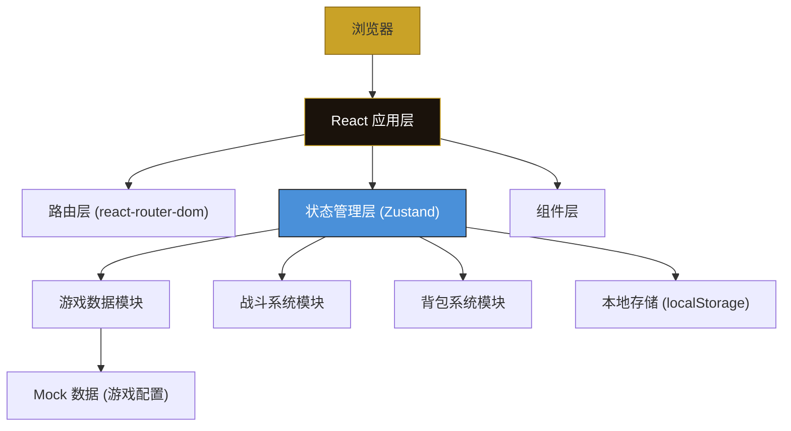

## 1. 架构设计



**架构说明**：
- 纯前端单页应用，无后端服务
- 使用 Zustand 进行全局状态管理，支持多模块状态
- 游戏配置数据通过 Mock 数据模块提供
- 玩家进度通过 localStorage 持久化存储
- 战斗逻辑独立为纯函数模块，便于测试和维护

## 2. 技术描述

- **前端框架**：React@18 + TypeScript@5
- **构建工具**：Vite@5
- **路由管理**：react-router-dom@6
- **状态管理**：zustand@4
- **样式方案**：TailwindCSS@3 + CSS Variables
- **图标库**：lucide-react
- **动画库**：framer-motion（用于复杂动画）
- **数据持久化**：localStorage
- **后端**：无（纯前端应用）
- **数据库**：无（使用 Mock 数据 + localStorage）

**项目初始化命令**（Windows）：
```
npm init vite-init@latest -y . "--" --template react-ts --force
```

## 3. 路由定义

| 路由路径 | 页面名称 | 说明 |
|----------|----------|------|
| `/` | 主菜单 | 游戏入口，包含开始/继续/图鉴/设置 |
| `/team-setup` | 队伍编成 | 选择职业、调整站位、查看技能 |
| `/tower` | 塔层探索 | 显示当前楼层、房间选择 |
| `/battle` | 战斗棋盘 | 回合制战棋战斗场景 |
| `/event` | 事件房间 | 解谜/交易/休整/风险事件 |
| `/inventory` | 战利品背包 | 装备管理、词条查看、套装效果 |
| `/result` | 结算页 | 战斗/事件/通关/失败结算 |
| `/codex` | 图鉴 | 怪物图鉴、装备图鉴 |
| `/settings` | 设置 | 音量、画质、操作设置 |

## 4. 数据模型

### 4.1 实体关系图

```mermaid
erDiagram
    PLAYER ||--o{ CHARACTER : "拥有"
    CHARACTER ||--o{ EQUIPMENT : "穿戴"
    CHARACTER ||--o{ SKILL : "拥有"
    CHARACTER ||--o{ STATUS_EFFECT : "持有"
    PLAYER ||--o{ INVENTORY : "拥有"
    INVENTORY ||--o{ EQUIPMENT : "存储"
    INVENTORY ||--o{ ITEM : "存储"
    BATTLE ||--o{ CHARACTER : "参战"
    BATTLE ||--o{ ENEMY : "敌对"
    TOWER_FLOOR ||--o{ ROOM : "包含"
    ROOM ||--o| BATTLE : "触发"
    ROOM ||--o| EVENT : "触发"
    PLAYER ||--o{ SAVE_DATA : "存档"

    PLAYER {
        string id PK
        int gold
        int currentFloor
        int difficulty
        string[] unlockedDifficulties
    }
    
    CHARACTER {
        string id PK
        string classId FK
        string name
        int level
        int exp
        int hp
        int maxHp
        int mp
        int maxMp
        int attack
        int defense
        int speed
        int positionX
        int positionY
    }
    
    CLASS {
        string id PK
        string name
        string description
        int baseHp
        int baseAttack
        int baseDefense
        int baseSpeed
    }
    
    SKILL {
        string id PK
        string name
        string description
        int cooldown
        int currentCooldown
        int mpCost
        string type
        int range
    }
    
    EQUIPMENT {
        string id PK
        string name
        string rarity
        string slot
        string setId FK
        int attack
        int defense
        int hp
        STAT[] stats
    }
    
    STAT {
        string type
        int value
    }
    
    EQUIPMENT_SET {
        string id PK
        string name
        SET_BONUS[] bonuses
    }
    
    SET_BONUS {
        int pieceCount
        string effect
    }
    
    ITEM {
        string id PK
        string name
        string type
        string description
        int effectValue
    }
    
    ENEMY {
        string id PK
        string name
        int hp
        int maxHp
        int attack
        int defense
        int speed
        string[] skills
    }
    
    ROOM {
        string id PK
        string type
        bool cleared
    }
    
    EVENT {
        string id PK
        string type
        string description
        EVENT_OPTION[] options
    }
    
    EVENT_OPTION {
        string text
        string resultType
        int value
    }
    
    CODEX {
        string enemyIds[]
        string equipmentIds[]
    }
```

### 4.2 核心类型定义

```typescript
// 职业类型
type CharacterClass = 'warrior' | 'mage' | 'assassin' | 'priest' | 'ranger' | 'guardian';

// 稀有度
type Rarity = 'common' | 'uncommon' | 'rare' | 'epic' | 'legendary';

// 装备槽位
type EquipmentSlot = 'weapon' | 'armor' | 'helmet' | 'boots' | 'accessory';

// 房间类型
type RoomType = 'battle' | 'elite' | 'boss' | 'event' | 'rest' | 'treasure';

// 事件类型
type EventType = 'puzzle' | 'trade' | 'rest' | 'gamble';

// 行动类型
type ActionType = 'move' | 'attack' | 'defend' | 'item' | 'skill';

// 状态效果
type StatusEffectType = 'poison' | 'burn' | 'stun' | 'shield' | 'buff_attack' | 'buff_defense';

interface Character {
  id: string;
  name: string;
  class: CharacterClass;
  level: number;
  exp: number;
  hp: number;
  maxHp: number;
  mp: number;
  maxMp: number;
  baseStats: {
    attack: number;
    defense: number;
    speed: number;
  };
  position: { x: number; y: number };
  equipment: Record<EquipmentSlot, Equipment | null>;
  skills: Skill[];
  statusEffects: StatusEffect[];
}

interface Skill {
  id: string;
  name: string;
  description: string;
  cooldown: number;
  currentCooldown: number;
  mpCost: number;
  type: 'damage' | 'heal' | 'buff' | 'debuff';
  range: number;
  damage?: number;
  heal?: number;
}

interface Equipment {
  id: string;
  name: string;
  rarity: Rarity;
  slot: EquipmentSlot;
  setId?: string;
  baseStats: {
    attack?: number;
    defense?: number;
    hp?: number;
    mp?: number;
    speed?: number;
  };
  stats: {
    type: string;
    value: number;
  }[];
}

interface EquipmentSet {
  id: string;
  name: string;
  bonuses: {
    pieceCount: number;
    effect: string;
    stats: Record<string, number>;
  }[];
}

interface Enemy {
  id: string;
  name: string;
  hp: number;
  maxHp: number;
  attack: number;
  defense: number;
  speed: number;
  position: { x: number; y: number };
  skills: string[];
  expReward: number;
  goldReward: number;
  lootTable: { itemId: string; chance: number }[];
}

interface BattleState {
  playerCharacters: Character[];
  enemies: Enemy[];
  turnOrder: string[];
  currentTurn: number;
  selectedUnit: string | null;
  selectedAction: ActionType | null;
  moveRange: { x: number; y: number }[];
  attackRange: { x: number; y: number }[];
  battleLog: string[];
}

interface PlayerState {
  gold: number;
  currentFloor: number;
  difficulty: number;
  unlockedDifficulties: number[];
  inventory: {
    equipment: Equipment[];
    items: { id: string; quantity: number }[];
  };
  codex: {
    enemies: string[];
    equipment: string[];
  };
}
```

### 4.3 本地存储结构

```typescript
interface SaveData {
  version: string;
  playerState: PlayerState;
  characters: Character[];
  currentRoom: string | null;
  towerState: {
    floor: number;
    rooms: Room[];
    currentRoomIndex: number;
  };
  timestamp: number;
}

// 存储键名
const STORAGE_KEYS = {
  SAVE_DATA: 'mechanic_tower_save',
  SETTINGS: 'mechanic_tower_settings',
  CODEX: 'mechanic_tower_codex',
} as const;
```

## 5. 核心模块结构

```
src/
├── components/          # 可复用组件
│   ├── ui/             # 基础UI组件（按钮、卡片等）
│   ├── CharacterCard/  # 角色卡片组件
│   ├── BattleGrid/     # 战斗棋盘组件
│   ├── EquipmentSlot/  # 装备槽位组件
│   └── StatusIcon/     # 状态图标组件
├── pages/              # 页面组件
│   ├── MainMenu/       # 主菜单
│   ├── TeamSetup/      # 队伍编成
│   ├── TowerMap/       # 塔层地图
│   ├── Battle/         # 战斗场景
│   ├── EventRoom/      # 事件房间
│   ├── Inventory/      # 背包
│   ├── Result/         # 结算页
│   └── Codex/          # 图鉴
├── store/              # Zustand 状态管理
│   ├── useGameStore.ts # 游戏主状态
│   ├── useBattleStore.ts # 战斗状态
│   └── usePlayerStore.ts # 玩家状态
├── data/               # Mock 数据
│   ├── classes.ts      # 职业数据
│   ├── skills.ts       # 技能数据
│   ├── equipment.ts    # 装备数据
│   ├── enemies.ts      # 敌人数据
│   ├── events.ts       # 事件数据
│   └── sets.ts         # 套装数据
├── utils/              # 工具函数
│   ├── battle.ts       # 战斗计算
│   ├── random.ts       # 随机生成
│   ├── storage.ts      # 本地存储
│   └── formula.ts      # 游戏公式
├── types/              # TypeScript 类型定义
│   └── game.ts         # 游戏核心类型
├── hooks/              # 自定义 Hooks
│   ├── useBattle.ts    # 战斗逻辑 Hook
│   └── useAnimation.ts # 动画 Hook
├── App.tsx             # 应用入口
└── main.tsx            # React 入口
```

## 6. 核心算法说明

### 6.1 战斗回合顺序
```
1. 收集所有参战单位（玩家角色 + 敌人）
2. 按速度属性降序排列，速度相同随机决定
3. 按顺序执行每个单位的回合
4. 所有单位行动完毕后进入下一回合
```

### 6.2 伤害计算公式
```
基础伤害 = 攻击力 - 防御力 * 0.5
暴击判定 = 随机(0,1) < 暴击率
暴击伤害 = 基础伤害 * (1.5 + 暴击伤害加成)
最终伤害 = 暴击伤害 * 属性克制系数 * 随机浮动(0.9~1.1)
```

### 6.3 移动范围计算（BFS）
```
1. 以当前位置为起点
2. 使用广度优先搜索遍历可达格子
3. 每移动一格消耗1点行动力
4. 排除障碍物和敌方单位占据的格子
5. 返回所有可达位置
```

### 6.4 装备词条生成
```
1. 根据稀有度确定词条数量（普通1~2，稀有2~3，史诗3~4，传说4~5）
2. 从词条池中随机抽取词条类型
3. 根据稀有度确定数值范围
4. 主属性固定，副属性随机
```

### 6.5 楼层生成算法
```
1. 每层固定10个房间
2. 第1、2层：6战斗 + 2事件 + 1休整 + 1宝箱
3. 第3层及以上：增加精英战斗和Boss
4. 房间顺序随机排列，保证路线多样性
```
